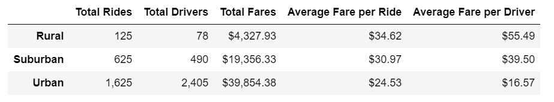
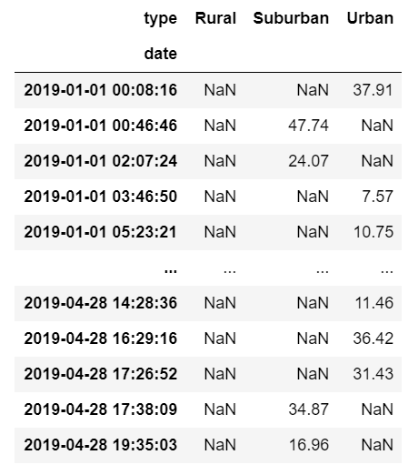
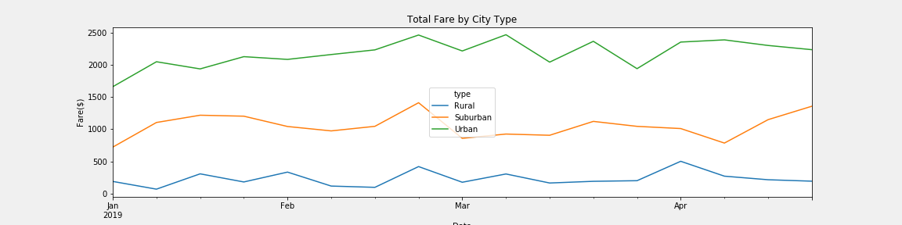

# PyBer_Analysis

## Project Overview
The purpose of this project was to analyze all the data for ridesharing app company Pyber from January to early May of 2019 and create a visualization for the CEO, V. Isualize. The objective was to:

1. Create a summary DataFrame of the ride-sharing data by city type.
2. Create a multiple-line graph that shows the total weekly fares for each city type.

## Resources
- Data Sources: [PyBer_ride_data.csv](Resources/PyBer_ride_data.csv); [city_data.csv](Resources/city_data.csv); [ride_data.csv](Resources/ride_data.csv)
- Software: Jupyter Notebook

## Results
- Pyber Analysis: [PyBer_Challenge.ipynb](PyBer_Challenge.ipynb)

### Differences in Ride-sharing Data Among the Different City Types
Ride-sharing Data by City Type
 

 
- Rural areas appear to have had the least amount of rides, with 125 rides, while Urban cicties had the most, with 1,625 rides.
- Urban areas had the most number of drivers, with 2,405 drivers. Suburban cities came in second, with 490 drivers, and rural cities with 78 drivers.
- Average fares were highest in rural cities, at $34.62. Urban city fares averaged at $24.53, and Suburban city fares average $30.97.
- Rural communities had an average fare per driver of $55.59, Suburban $39.50, and Urban cities $16.57.

Ride-sharing Data for City Type by Date
 

 
- Between the dates of 01/01/2019 and 04/29/2019, urban cities had the least amount of rides, many days having 0 rides.
- Suburban cities also had numerous dates with no ride data.
- Urban cities appear to have had the most days with rides.

Total Fare by CIty Type
 

 
- Between the date of 01/01/2019 and 04/29/2019, Urban cities had the highest fare totals per day.
- Rural areas had the least fare totals per day.

## Summary
### Recommendations to the CEO for Addressing Any Disparities Among the City Types:
- Based on the data, it is recommended that:
  - More drivers are hired for Urban cities, as they have the highest number of rides per day. The more drivers available, the more rides can be requested by users.
  - 
